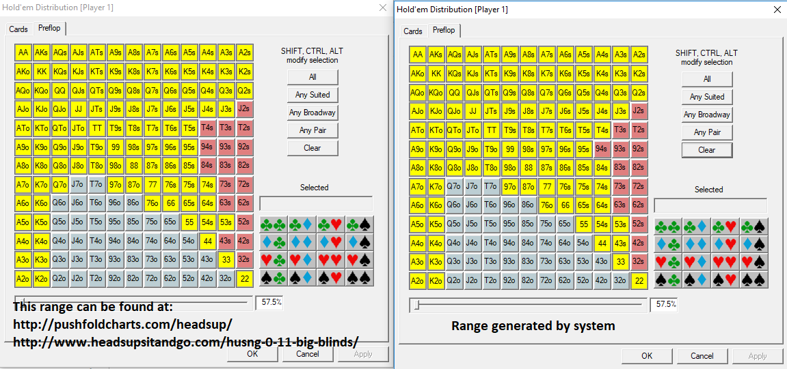
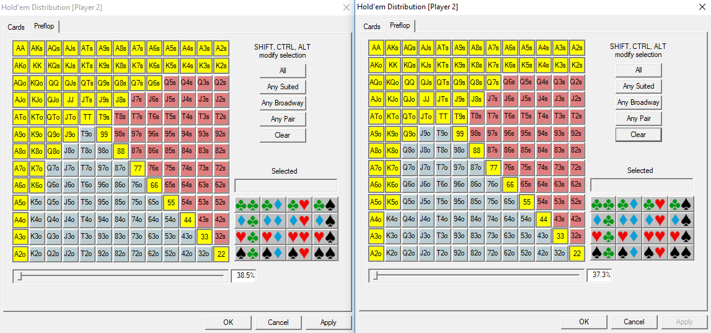

# Regret-based system to reach Nash equilibrium  
A regret-based system is a way for a system to learn the appropriate action in a given situation based on the amount of regret that was assigned the last time the system chose the same action in the same or a similar situation. This is similar to how humans attain intuition.

The task is to create a regret-based system that attempts to reach Nash equilibrium for push/fold heads-up no-limit Texas hold ’em when the effective stack size is *x* big blinds. To do so the following is required:

* A regret-based system that, over millions of hands, learns the decision that results in the most expected value in any given situation.
* A hand evaluator so the system can identify which player wins a specific seven-card hand.

The result will be checked against other Nash equilibrium charts generated by different sources.

## Table of contents
1. [Required components](#required-components)
2. [Hand evaluator](#hand-evaluator)
3. [Regret tree](#regret-tree)
4. [Storage issues](#storage-issues)
5. [File structure](#file-structure)
6. [Regret system](#regret-system)
7. [Results](#results)

## Required components 
* A way to evaluate the strength of seven-card hands.
* A way to store a regret tree.
* A way to cycle through millions of hands, trying all possible different actions for every hand and updating the regret system accordingly.

## Hand evaluator 
With the TwoPlusTwo hand evaluator, the strength of a given seven-card hand can be evaluated. The strength is represented as a number. When the number is higher, the hand is stronger. By comparing this number with the number strength of another seven cards, it can be determined which hand wins.

Cards are represented by integers 1-52:

*Note: The order of the suits does not matter as long as it is consistent.*

### Regret tree 

*Figure 1: A very simplified version of the regret tree considering only three different starting hands.*

Figure 1 is a simplified representation of how the regret tree is constructed. The actual regret tree looks the same but has 169 nodes for the small blind and 169 nodes for the big blind since there are 169 different starting hand groups in Texas hold ‘em. This means that the actual regret tree consists of 169 ⋅ 2 = 338 regret nodes.

Note: There are actually 1 326 combinations of possible starting hands but only 169 matter since for example Tc9c from a preflop perspective can be viewed the same as Th9h, so these are grouped with the two other same-suit combinations of tens and nines and are called them T9s.

Note 2: Fold is not given any regret since the expected value of folding will always be zero. The situation is analyzed after the blinds are placed, with the blinds simply being regarded as part of the pot.

Note 3: The information put in the tree could be better visualized with a table, but a tree is used since that is what would be used for a more complex problem.

### Storage issues 
In this particular case with only 338 regret nodes, storage or memory issues is not a concern. However, in a more complicated system, this might be an issue. If only one byte was used as a regret node, a regret value would range from -128 to 127. One successful push from the small blind would increase the regret value by 21 since 19 small blinds were used for the push and 40 small blinds were won; the profit would therefore be 21 small blinds. Already, more than 16 % of the limit of positive regret would have been used. This could create problems with variance since simulating millions of hands could cap regret nodes before the system could come to a valid conclusion of what the right action is in the specific spot.

Instead, if two bytes were used as the size for a regret node, one successful push would use up more than 0.06 % of the limit of positive regret. This might work for this problem, since it takes 1561 successful pushes to cap the regret node and it seems intuitively unreasonable that variance could bring this to below zero again after it is capped. For larger problems than this, with for example 200 small blinds in play, only 163 successful pushes from the small blind are needed to cap the regret node. This is a significantly different number than 1 561. Higher stack sizes require more regret node storage to prevent premature capping of regret nodes.

With that said, in the simple case presented here, 4 bytes are used to ensure that variance will not be a problem. Further investigation is required to understand the relationship between node storage size and variance. Logarithmic growth of regret might be a way to require less storage space while still ensuring that variance will not negatively affect results. Further investigation and testing is required to reach a conclusion here.

In total, the regret file takes up 1 352 bytes of space.

### File structure 
The program generates a regret.dat file if one does not already exist. Half the file is dedicated to the small blind and half the file to the big blind. More specifically, the first 676 bytes are dedicated to the small blind and the following 676 bytes are dedicated to the big blind. The order of hands starts with all the pairs 22-AA, then cycles through all the offsuited combinations 32o-A2o, 43o-A3o, …, KQo-AQo, AKo and finally cycle through the suited combinations in the same way.

*Figure 2: Table of all starting hands (image source: PokerStove).*

The file is loaded into a vector of 4-byte integers and it is important to know how to correctly navigate through this vector.

If, for example, the regret node for the big blind calling with T5s is searched for, we take the following steps:

1. Skip past half the nodes (169).
2. Skip past all the pairs (13).
3. Skip past all the offsuited combination nodes (78).
4. Skip past all the suited combinations before T5s (37).
5. The regret node searched for is reached.

The conclusion reached by adding these numbers up is that the first 297 elements in the vector must be skipped. Since the first index is zero this would mean that the node is at index 297. The right index is found through the RegretTree’s RegretIndex function.

## Regret system 
As previously mentioned, only 169 hand combinations are relevant to this problem. In actuality, it is necessary to ensure that the same T9s against the same 56o are not matched against each other every time, since there are three possible matchups in this case:
* 56o does not share any suit with T9s.
* The five in 56o is the same suit as T9s.
* The six in 56o is the same suit as T9s.

These three matchups will play slightly differenty against each other. An easy way to solve this is to pick completely random cards from a deck when hand evaluation and then convert them to one of the 169 hand combinations. This is what the program does.

A way to accurately modify regret based on the result of an action is required. Adding or subtracting one regret depending if the action was favorable or unfavorable is insufficient since the small blind and the big blind get different amounts of profit and loss depending on the outcome of push or call. Therefore, the profit or loss in small blinds determins how much the regret is modified. A profit results in an increased regret and a loss results in a decreased regret.

## Results 

*Figure 3: Shows push ranges of a well known chart vs. push ranges the regret-based system generated*

*Figure 3: Shows call ranges of a well known chart vs. call ranges the regret-based system generated*

The charts are similar, but not identical. When tested against each other using PokerStove, the following result is aquired:

*Figure 4: Calculations based on numbers from PokerStove.*

Note: The hand range percentage from PokerStove is not accurate. This might have to do with that the amount of combinations for each offsuited hand and suited hand is eight versus four.

According to the calculation presented in *Figure 4*, the strategy developed by the regret-based system wins versus the push/fold-chart by approximately 3,78 big blinds per 100 hands.
